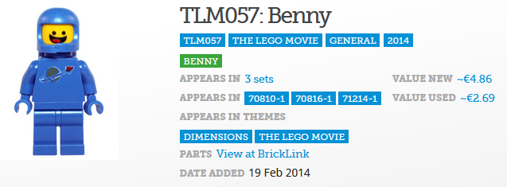

# Scraping exercices

## Minifigs

Make sure you add more information about every minifig to the list.

* Code (TLM057)
* Name (Benny)
* Categories as tuples (name/link) (TLM057, The lego movie, general, 2014)
* Appears in nr of sets (3)
* Appears in which sets as tuples (name/link)
* Date added (19 Feb 2014 as a date)
* Value new (4,86 as decimal number)
* Value used (2,68 as decimal number)

## The heaviest list

Make sure you get all information about the songs:

* Band name (Metallica)
* Song name (Master Of Puppets)
* Current position (1)
* Previous position (1)
* Number of times in the list (7)

Also make sure you get all pages:

You can solve this by emulating a click on the next page using the webdriver. Then repeat the scraping process until you've had them all.

Export the list in a CSV-file

## Staalhard 100

Belgium has a lot of radio stations, and Willy, another one, also has a [list of the best heavy metal records](https://www.willy.radio/hitlijsten/staalhard-100-bekijk-de-lijst). Scrape it and export this list in another CSV-file. Compare the two: which songs are on the heaviest list but not on the steel-hard 100 and visa versa? Which are on both?
